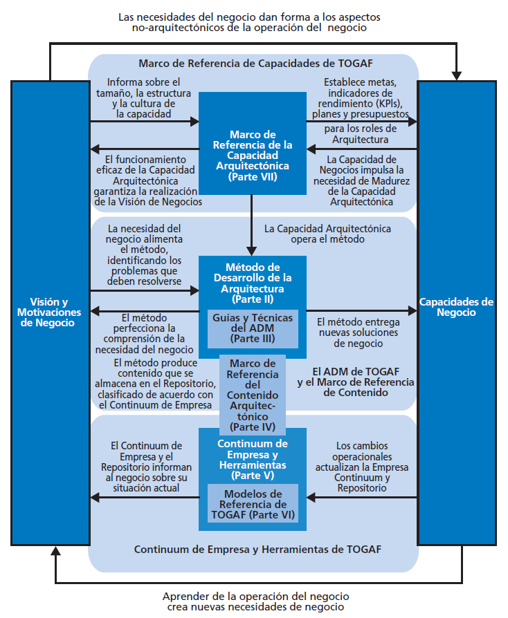
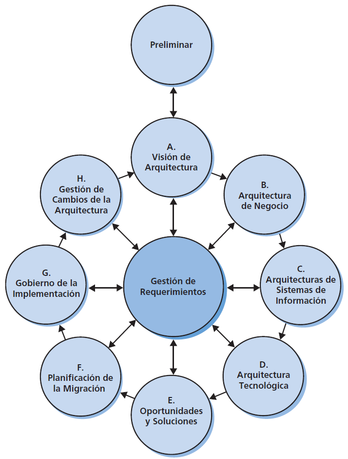

# CAPITULO 1 : INTRODUCCIÓN

## Introducción

Es una herramienta para asistir en la aceptación, creación, uso y mantenimiento de arquitcturas.

## Estructura del Documento TOGAF

### 1. Introducción
Se proporcionan los conceptos claves de la arquitectura empresarial.
 
### 2. Método de Desarrollo de la Arquitectura (ADM)
Es el núcleo de TOGAF

### 3. Guias y Técnicas del ADM
Contiene una colección de guias y técnicas disponibles para la aplicación del ADM.

### 4. Marco de Referencia del Contenido Arquitectonico
Es una descripción del marco que incluye un metamodelo estructurado para artefactos arquitectónicos, el uso de bloques de contrucción de la arquitectura (ABB) reutilizables y una descripción de entregables tipicos de arquitectura.

### 5. Continuum de Empresa y sus herramientas
Se trata la taxonomías apropiadas y las herramientas para clasificar y almacenar los resultados de la actividad de arquitectura dentro de la empresa.

### 6. Modelos de referencias de TOGAF
Proporciona dos modelos de referencia aquitectonico:
- Modelo de Referencia Técnico - TRM
- Modelo de Referencia para la Infraestructura de la Información Integrada - IIIRM

### 7. Marco de Referencia de la Capacidad Arquitectonica
Trata de la organizacion, procesos, habilidades, roles y responsabilidades requeridas para establer y operar una prácticade arquitectura dentro de la empresa.

TOGAF refleja la estructura y el contenido de la Capacidad Arquitectónica dentro de una empresa, como se muestra en la siguiente figura.

## Tipos de Arquitectura soportados por TOGAF

### Arquitectura de Negocios
La estrategia de negocio, gobierno, organización y procesos clave de la organización

### Arquitectura de Datos
La estructura de datos lógicos y fisicos que posee una organización y sus recursos de gestión de datos

### Arquitectura de Aplicación 
Un plano de las aplicaciones individuales a implementar, sus iteracciones y sus relaciones con os procesos de negocio principales de la organización

### Arquitectura Tecnológica
Las capacidades de software y hardware que se requieren para apoyar la implementación de servicios de negocios, datos y aplicación. Esto incluye infraestructura de TI, capa de mediación, redes, comunicaciones, procesamiento y estándares.

## Que es Metodo de Desarrollo de Arquitectura ADM

El metodo de desarrollo de arquitectura (ADM por sus siglas en inglés), es un método para obtener Arquitecturas Empresariales que son específicas para la organización, y está especialmente diseñado para responder a los requerimiento del negocio. El ADM describe:
- Un modo confiable y probado para desarrollar y utilizar una Arquitectura Empresarial.
- Un método para desarrollar arquicturas en diferentes niveles (negocio, aplicaciones, datos, tecnología) que permiten al arquitecto asegurar que un conjunto complejo de requerimientos se aborden adecuadamente.
- Un conjunto de guías y técnicas para el desarrollo de arquitectura.

## Las Fases del ADM

El ADM consiste en varias Fases que se desplazan cíclicamente a través de una serie de Dominios de Arquitectura y permiten al arquitecto asegurar que un conjunto complejo de requerimientos se aborden adecuadamente. La estructura básica del ADM se muestra en la siguiente figura:

El ADM se aplica iterativamente durante todo el proceso, entre las diferentes Fases, y dentro de ellas. Durante todo el ciclo del ADM se debe realizar una validación frecuente de los resultados respecto a los requerimientos originales, tanto aquellos del ciclo completo del ADM como los de la Fase particular del proceso. Esta validación debe reconsiderar el alcance, los detalles, el plan y los hitos de las interaciones anteriores del proceso y los activos externos de mercado, asi como otros marcos de referencia o modelos.

El ADM apoya el concepto de interación de tres niveles:

- __Ciclo alrededor del ADM__
El ADM se presenta de manera circular indicando que la finalización de una Fase de trabajo en la arquitectura alimenta dirtectamente las Fases subsecuentes de trabajo en la arquitectura.

- __Iteración entre Fases__
TOGAF describe el concepto de la interación a través de Fases (por ejemplo, volviendo a la Arquitectura de Negocio posteriormente a la finalización de la Arquitectura Tecnológica)

- __Ciclo alrededor de una Fase individual__
TOGAF apoya la ejecución repetida de las actividades dentro de una Fase individual del ADM como una técnica para elaborar contenido arquitectónico.

Resumen de Fases del ADM

| Fase de ADM                           | Actividad                                                                                                                                                                                                                                                                      |
|---------------------------------------|--------------------------------------------------------------------------------------------------------------------------------------------------------------------------------------------------------------------------------------------------------------------------------|
| Preliminar                            | Emprende las actividades de iniciación y preparación requeridas para crear la Capacidad Arquitectónica, incluyendo la adaptación de TOGAF, la selección de herramientas y la definición de Principios de Arquitectura.                                                         |
| Gestión de Requerimientos             | Los requeriminetos se identifican, almacenan y se gestionan al ingreso y egreso de las Fases relevantes del ADM, las cuales eliminan, abordan, y priorizan los requerimientos.                                                                                                 |
| Arquitectura de Negocio               | Se describe como debe operar la empresa para alcanzar sus objetivos de negocio                                                                                                                                                                                                 |
| Arquitectura de SI y TI               | Incluye los otros 3 dominios: Aplicaciones, Datos y Tecnología                                                                                                                                                                                                                 |
| Oportunidades y Soluciones            | Realiza la planificación de la implementación inicial y la identificación de medios de entrega para los Bloques de Construcción identificados en las Fases anteriores. Determina si se requiere un enfoque incremental, y si así fuera, identifica Arquitecturas de Transición |
| Planificación de la Migración         | Desarrolla el Plan detallado de Implementación y Migración que aborda cómo moverse de la Arquitectura de la Línea de Base a la Arquitectura de Destino.                                                                                                                        |
| Gobierno de la Implementación         | Proporciona supervisión arquitectónica para la implementación. Prepara y publica Contratos de Arquitectura. Asegura que el proyecto de implementación esté en conformidad con la arquitectura                                                                                  |
| Gestión de Cambios de la Arquitectura | Proporciona seguimiento continuo y un proceso de gestión de cambios para asegurar que la arquitectura responda a las necesidades de la empresa y que se maximice el valor de la arquitectura para el negocio.                                                                  |

## LABORATORIO 01 : Preparación de Plantilla

Abrimos el programa Archimate, y procedemos a nombrar el proyeto, en este caso se llamara Seguros_Arqui, que hace referencia a una empresa de seguros.

Luego procedemos a arrastrar el componente __"Group"__ que se encuentra dentro de la barra __Palette__, luego hacemos click en Properties > Appearance > Border > Rectangle. Esto nos convierte el gráfico en un rectangulo.

Luego para agregar el contenido de esas etiquetas, debemos ingresar a Properties > Label > Label Expression, y agredamos el contenido. De tal manera que se vea de la siguiente forma:

