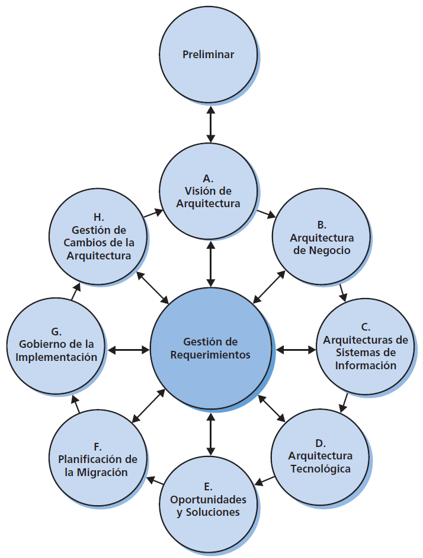

# CAPITULO 02: EL MÉTODO DE DESARROLLO DE LA ARQUITECTURA

## Que es ADM

El metodo de desarrollo de arquitectura (ADM por sus siglas en inglés), es un método para obtener Arquitecturas Empresariales que son específicas para la organización, y está especialmente diseñado para responder a los requerimiento del negocio. El ADM describe:
- Un modo confiable y probado para desarrollar y utilizar una Arquitectura Empresarial.
- Un método para desarrollar arquicturas en diferentes niveles (negocio, aplicaciones, datos, tecnología) que permiten al arquitecto asegurar que un conjunto complejo de requerimientos se aborden adecuadamente.
- Un conjunto de guías y técnicas para el desarrollo de arquitectura.

## Las Fases del ADM

El ADM consiste en varias Fases que se desplazan cíclicamente a través de una serie de Dominios de Arquitectura y permiten al arquitecto asegurar que un conjunto complejo de requerimientos se aborden adecuadamente. La estructura básica del ADM se muestra en la siguiente figura:

El ADM se aplica iterativamente durante todo el proceso, entre las diferentes Fases, y dentro de ellas. Durante todo el ciclo del ADM se debe realizar una validación frecuente de los resultados respecto a los requerimientos originales, tanto aquellos del ciclo completo del ADM como los de la Fase particular del proceso. Esta validación debe reconsiderar el alcance, los detalles, el plan y los hitos de las interaciones anteriores del proceso y los activos externos de mercado, asi como otros marcos de referencia o modelos.

El ADM apoya el concepto de interación de tres niveles:

- __Ciclo alrededor del ADM__
El ADM se presenta de manera circular indicando que la finalización de una Fase de trabajo en la arquitectura alimenta dirtectamente las Fases subsecuentes de trabajo en la arquitectura.

- __Iteración entre Fases__
TOGAF describe el concepto de la interación a través de Fases (por ejemplo, volviendo a la Arquitectura de Negocio posteriormente a la finalización de la Arquitectura Tecnológica)

- __Ciclo alrededor de una Fase individual__
TOGAF apoya la ejecución repetida de las actividades dentro de una Fase individual del ADM como una técnica para elaborar contenido arquitectónico.

